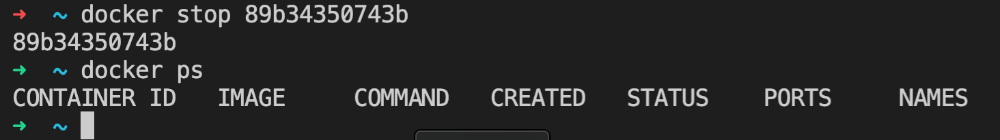

# Part 1

## Шаг 1 — Взять официальный докер образ с nginx и выкачать его при помощи docker pull

```
docker pull nginx
```


## Шаг 2 - Проверить наличие докер образа через docker images

```
docker images
```


## Шаг 3 - Запустить докер образ через docker run -d [image_id|repository]

```
docker run  -d nginx
```


## Шаг 4 - Проверить, что образ запустился через docker ps

```
docker ps
```


## Шаг 5 - Посмотреть информацию о контейнере через docker inspect [container_id|container_name]

```
docker inspect nginx
```

Вывод
```
[
    {
        "Id": "sha256:448a08f1d2f94e8db6db9286fd77a3a4f3712786583720a12f1648abb8cace25",
        "RepoTags": [
            "nginx:latest"
        ],
        "RepoDigests": [
            "nginx@sha256:480868e8c8c797794257e2abd88d0f9a8809b2fe956cbfbc05dcc0bca1f7cd43"
        ],
        "Parent": "",
        "Comment": "",
        "Created": "2023-05-03T19:51:06.214253945Z",
        "Container": "a4589847511fc5545db6600740abeb1c991a29ecf9a4b1e3d9b74ae565d373a5",
        "ContainerConfig": {
            "Hostname": "a4589847511f",
            "Domainname": "",
            "User": "",
            "AttachStdin": false,
            "AttachStdout": false,
            "AttachStderr": false,
            "ExposedPorts": {
                "80/tcp": {}
            },
            "Tty": false,
            "OpenStdin": false,
            "StdinOnce": false,
            "Env": [
                "PATH=/usr/local/sbin:/usr/local/bin:/usr/sbin:/usr/bin:/sbin:/bin",
                "NGINX_VERSION=1.23.4",
                "NJS_VERSION=0.7.11",
                "PKG_RELEASE=1~bullseye"
            ],
            "Cmd": [
                "/bin/sh",
                "-c",
                "#(nop) ",
                "CMD [\"nginx\" \"-g\" \"daemon off;\"]"
            ],
            "Image": "sha256:3a939c4944ef49bcf282f201919718dc414fd79c7761fe46ed6cdad1ac2d6564",
            "Volumes": null,
            "WorkingDir": "",
            "Entrypoint": [
                "/docker-entrypoint.sh"
            ],
            "OnBuild": null,
            "Labels": {
                "maintainer": "NGINX Docker Maintainers <docker-maint@nginx.com>"
            },
            "StopSignal": "SIGQUIT"
        },
        "DockerVersion": "20.10.23",
        "Author": "",
        "Config": {
            "Hostname": "",
            "Domainname": "",
            "User": "",
            "AttachStdin": false,
            "AttachStdout": false,
            "AttachStderr": false,
            "ExposedPorts": {
                "80/tcp": {}
            },
            "Tty": false,
            "OpenStdin": false,
            "StdinOnce": false,
            "Env": [
                "PATH=/usr/local/sbin:/usr/local/bin:/usr/sbin:/usr/bin:/sbin:/bin",
                "NGINX_VERSION=1.23.4",
                "NJS_VERSION=0.7.11",
                "PKG_RELEASE=1~bullseye"
            ],
            "Cmd": [
                "nginx",
                "-g",
                "daemon off;"
            ],
            "Image": "sha256:3a939c4944ef49bcf282f201919718dc414fd79c7761fe46ed6cdad1ac2d6564",
            "Volumes": null,
            "WorkingDir": "",
            "Entrypoint": [
                "/docker-entrypoint.sh"
            ],
            "OnBuild": null,
            "Labels": {
                "maintainer": "NGINX Docker Maintainers <docker-maint@nginx.com>"
            },
            "StopSignal": "SIGQUIT"
        },
        "Architecture": "amd64",
        "Os": "linux",
        "Size": 142145739,
        "VirtualSize": 142145739,
        "GraphDriver": {
            "Data": {
                "LowerDir": "/var/lib/docker/overlay2/27fc5c5999e65571dca00b9e193182904f7ef5ae1345b989ec83b7b5a5856934/diff:/var/lib/docker/overlay2/8a79fc9807440da84a1f1dc8321554c660a0697f6a32be3fba738af5aeb6d0d0/diff:/var/lib/docker/overlay2/34883be06866410bc5238a939af0fd1c83eb84b296d7f902091e70a47dee45ab/diff:/var/lib/docker/overlay2/f29672b638877d030a55fc5ff66ade1d3c646554190838993dce3f959a52f3c9/diff:/var/lib/docker/overlay2/f1145277956c03ecbf4b1528e28ba9d19fded2f1788ca91766f190d1c6753006/diff",
                "MergedDir": "/var/lib/docker/overlay2/09ef33ddd3c9d2f857e4fec83e2e1623098fbd6aebbd62f449419d9a9eb5684f/merged",
                "UpperDir": "/var/lib/docker/overlay2/09ef33ddd3c9d2f857e4fec83e2e1623098fbd6aebbd62f449419d9a9eb5684f/diff",
                "WorkDir": "/var/lib/docker/overlay2/09ef33ddd3c9d2f857e4fec83e2e1623098fbd6aebbd62f449419d9a9eb5684f/work"
            },
            "Name": "overlay2"
        },
        "RootFS": {
            "Type": "layers",
            "Layers": [
                "sha256:8553b91047dad45bedc292812586f1621e0a464a09a7a7c2ce6ac5f8ba2535d7",
                "sha256:a29cc9587af6488ae0cbb962ecbe023d347908cc62ca5d715af06e54ccaa9e36",
                "sha256:6bc8ae8fb3cf0909b3d9c2e74f6cabe16e6a2322c52cec76fbaecaef47006f1d",
                "sha256:5684be535bf11cb9ad1a57b51085f36d84ae8361eabc2b4c2ba9a83e8b084b20",
                "sha256:93ee76f39c974e4f819e632149c002d6f509aadc5995ec6523a96b337751c8ed",
                "sha256:1040838fe30e6f26d31bde96c514f47ee4bf727b3f1c3c7b045ea3891c1c2150"
            ]
        },
        "Metadata": {
            "LastTagTime": "0001-01-01T00:00:00Z"
        }
    }
]
```

```
docker inspect nginx
```

Вывод
```
[
    {
        "Id": "89b34350743b514e1f8e7a066a76b2a2abf181655af79d52beb4db1e1fd78136",
        "Created": "2023-05-18T12:49:21.225895109Z",
        "Path": "/docker-entrypoint.sh",
        "Args": [
            "nginx",
            "-g",
            "daemon off;"
        ],
        "State": {
            "Status": "running",
            "Running": true,
            "Paused": false,
            "Restarting": false,
            "OOMKilled": false,
            "Dead": false,
            "Pid": 7124,
            "ExitCode": 0,
            "Error": "",
            "StartedAt": "2023-05-18T12:49:21.457741552Z",
            "FinishedAt": "0001-01-01T00:00:00Z"
        },
        "Image": "sha256:448a08f1d2f94e8db6db9286fd77a3a4f3712786583720a12f1648abb8cace25",
        "ResolvConfPath": "/var/lib/docker/containers/89b34350743b514e1f8e7a066a76b2a2abf181655af79d52beb4db1e1fd78136/resolv.conf",
        "HostnamePath": "/var/lib/docker/containers/89b34350743b514e1f8e7a066a76b2a2abf181655af79d52beb4db1e1fd78136/hostname",
        "HostsPath": "/var/lib/docker/containers/89b34350743b514e1f8e7a066a76b2a2abf181655af79d52beb4db1e1fd78136/hosts",
        "LogPath": "/var/lib/docker/containers/89b34350743b514e1f8e7a066a76b2a2abf181655af79d52beb4db1e1fd78136/89b34350743b514e1f8e7a066a76b2a2abf181655af79d52beb4db1e1fd78136-json.log",
        "Name": "/xenodochial_kapitsa",
        "RestartCount": 0,
        "Driver": "overlay2",
        "Platform": "linux",
        "MountLabel": "",
        "ProcessLabel": "",
        "AppArmorProfile": "docker-default",
        "ExecIDs": null,
        "HostConfig": {
            "Binds": null,
            "ContainerIDFile": "",
            "LogConfig": {
                "Type": "json-file",
                "Config": {}
            },
            "NetworkMode": "default",
            "PortBindings": {},
            "RestartPolicy": {
                "Name": "no",
                "MaximumRetryCount": 0
            },
            "AutoRemove": false,
            "VolumeDriver": "",
            "VolumesFrom": null,
            "ConsoleSize": [
                67,
                69
            ],
            "CapAdd": null,
            "CapDrop": null,
            "CgroupnsMode": "private",
            "Dns": [],
            "DnsOptions": [],
            "DnsSearch": [],
            "ExtraHosts": null,
            "GroupAdd": null,
            "IpcMode": "private",
            "Cgroup": "",
            "Links": null,
            "OomScoreAdj": 0,
            "PidMode": "",
            "Privileged": false,
            "PublishAllPorts": false,
            "ReadonlyRootfs": false,
            "SecurityOpt": null,
            "UTSMode": "",
            "UsernsMode": "",
            "ShmSize": 67108864,
            "Runtime": "runc",
            "Isolation": "",
            "CpuShares": 0,
            "Memory": 0,
            "NanoCpus": 0,
            "CgroupParent": "",
            "BlkioWeight": 0,
            "BlkioWeightDevice": [],
            "BlkioDeviceReadBps": [],
            "BlkioDeviceWriteBps": [],
            "BlkioDeviceReadIOps": [],
            "BlkioDeviceWriteIOps": [],
            "CpuPeriod": 0,
            "CpuQuota": 0,
            "CpuRealtimePeriod": 0,
            "CpuRealtimeRuntime": 0,
            "CpusetCpus": "",
            "CpusetMems": "",
            "Devices": [],
            "DeviceCgroupRules": null,
            "DeviceRequests": null,
            "MemoryReservation": 0,
            "MemorySwap": 0,
            "MemorySwappiness": null,
            "OomKillDisable": null,
            "PidsLimit": null,
            "Ulimits": null,
            "CpuCount": 0,
            "CpuPercent": 0,
            "IOMaximumIOps": 0,
            "IOMaximumBandwidth": 0,
            "MaskedPaths": [
                "/proc/asound",
                "/proc/acpi",
                "/proc/kcore",
                "/proc/keys",
                "/proc/latency_stats",
                "/proc/timer_list",
                "/proc/timer_stats",
                "/proc/sched_debug",
                "/proc/scsi",
                "/sys/firmware"
            ],
            "ReadonlyPaths": [
                "/proc/bus",
                "/proc/fs",
                "/proc/irq",
                "/proc/sys",
                "/proc/sysrq-trigger"
            ]
        },
        "GraphDriver": {
            "Data": {
                "LowerDir": "/var/lib/docker/overlay2/23faee66f7ef59116b441d712b54a09ec6487d60e243cc81fc73313f83b8a86f-init/diff:/var/lib/docker/overlay2/09ef33ddd3c9d2f857e4fec83e2e1623098fbd6aebbd62f449419d9a9eb5684f/diff:/var/lib/docker/overlay2/27fc5c5999e65571dca00b9e193182904f7ef5ae1345b989ec83b7b5a5856934/diff:/var/lib/docker/overlay2/8a79fc9807440da84a1f1dc8321554c660a0697f6a32be3fba738af5aeb6d0d0/diff:/var/lib/docker/overlay2/34883be06866410bc5238a939af0fd1c83eb84b296d7f902091e70a47dee45ab/diff:/var/lib/docker/overlay2/f29672b638877d030a55fc5ff66ade1d3c646554190838993dce3f959a52f3c9/diff:/var/lib/docker/overlay2/f1145277956c03ecbf4b1528e28ba9d19fded2f1788ca91766f190d1c6753006/diff",
                "MergedDir": "/var/lib/docker/overlay2/23faee66f7ef59116b441d712b54a09ec6487d60e243cc81fc73313f83b8a86f/merged",
                "UpperDir": "/var/lib/docker/overlay2/23faee66f7ef59116b441d712b54a09ec6487d60e243cc81fc73313f83b8a86f/diff",
                "WorkDir": "/var/lib/docker/overlay2/23faee66f7ef59116b441d712b54a09ec6487d60e243cc81fc73313f83b8a86f/work"
            },
            "Name": "overlay2"
        },
        "Mounts": [],
        "Config": {
            "Hostname": "89b34350743b",
            "Domainname": "",
            "User": "",
            "AttachStdin": false,
            "AttachStdout": false,
            "AttachStderr": false,
            "ExposedPorts": {
                "80/tcp": {}
            },
            "Tty": false,
            "OpenStdin": false,
            "StdinOnce": false,
            "Env": [
                "PATH=/usr/local/sbin:/usr/local/bin:/usr/sbin:/usr/bin:/sbin:/bin",
                "NGINX_VERSION=1.23.4",
                "NJS_VERSION=0.7.11",
                "PKG_RELEASE=1~bullseye"
            ],
            "Cmd": [
                "nginx",
                "-g",
                "daemon off;"
            ],
            "Image": "nginx",
            "Volumes": null,
            "WorkingDir": "",
            "Entrypoint": [
                "/docker-entrypoint.sh"
            ],
            "OnBuild": null,
            "Labels": {
                "maintainer": "NGINX Docker Maintainers <docker-maint@nginx.com>"
            },
            "StopSignal": "SIGQUIT"
        },
        "NetworkSettings": {
            "Bridge": "",
            "SandboxID": "b55497ad1aa7cbfba018b1209ac348af44772e55838d7cc0c5553cbc06e6ac93",
            "HairpinMode": false,
            "LinkLocalIPv6Address": "",
            "LinkLocalIPv6PrefixLen": 0,
            "Ports": {
                "80/tcp": null
            },
            "SandboxKey": "/var/run/docker/netns/b55497ad1aa7",
            "SecondaryIPAddresses": null,
            "SecondaryIPv6Addresses": null,
            "EndpointID": "29483ac5cd09eb11beb6e5ebb26dd6825ca07fb55d953a46b38e7f0952765439",
            "Gateway": "172.17.0.1",
            "GlobalIPv6Address": "",
            "GlobalIPv6PrefixLen": 0,
            "IPAddress": "172.17.0.2",
            "IPPrefixLen": 16,
            "IPv6Gateway": "",
            "MacAddress": "02:42:ac:11:00:02",
            "Networks": {
                "bridge": {
                    "IPAMConfig": null,
                    "Links": null,
                    "Aliases": null,
                    "NetworkID": "eab15ebad767550e52f8f81bd88510e31a00259d928fe662b50f173b57a0aa7d",
                    "EndpointID": "29483ac5cd09eb11beb6e5ebb26dd6825ca07fb55d953a46b38e7f0952765439",
                    "Gateway": "172.17.0.1",
                    "IPAddress": "172.17.0.2",
                    "IPPrefixLen": 16,
                    "IPv6Gateway": "",
                    "GlobalIPv6Address": "",
                    "GlobalIPv6PrefixLen": 0,
                    "MacAddress": "02:42:ac:11:00:02",
                    "DriverOpts": null
                }
            }
        }
    }
]
```


## Шаг 6 - По выводу команды определить и поместить в отчёт размер контейнера, список замапленных портов и ip контейнера

* "Size": 142145739
* "Ports": {"80/tcp": null}
* "IPAddress": "172.17.0.2"

## Шаг 7 - Остановить докер образ через docker stop [container_id|container_name] и проверить, что образ остановился через docker ps

```
docker stop 89b34350743b
docker ps
```



## Шаг 8 - Запустить докер с замапленными портами 80 и 443 на локальную машину через команду run

```
docker run -p 80:80 -p 443:443 -d nginx
```


## Шаг 9 - Проверить, что в браузере по адресу localhost:80 доступна стартовая страница nginx

```
curl localhost:80
```


## Шаг 10 - Перезапустить докер контейнер через docker restart [container_id|container_name]. Проверить любым способом, что контейнер запустился

```
docker restart container_name
docker ps
curl localhost:80
```


