# Part 1

## Шаг 1 - Прочитать конфигурационный файл nginx.conf внутри докер контейнера через команду exec

```
docker exec xenodochial_mcclintock cat /etc/nginx/nginx.conf
```

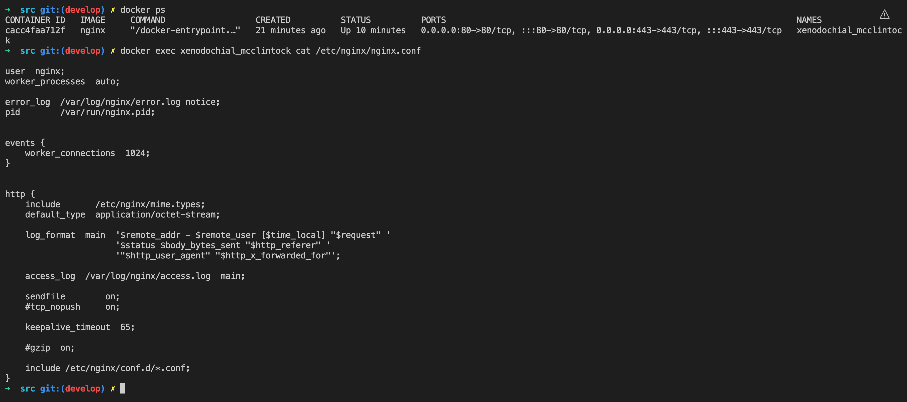

## Шаг 2 - Создать на локальной машине файл nginx.conf

```
docker exec xenodochial_mcclintock cat /etc/nginx/nginx.conf > nginx.conf
```

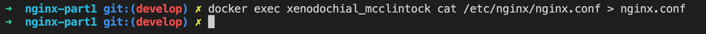

## Шаг 3 - Настроить в нем по пути /status отдачу страницы статуса сервера nginx

Содержание файла nginx.conf

```
events {
    worker_connections  1024;
}

http {
    server {
        listen       80;
        listen  [::]:80;
        server_name  localhost;

        #access_log  /var/log/nginx/host.access.log  main;

        location / {
            root   /usr/share/nginx/html;
            index  index.html index.htm;
        }

        location /status {
            stub_status; 
            allow all;
        }
        
        error_page   500 502 503 504  /50x.html;
        location = /50x.html {
            root   /usr/share/nginx/html;
        }
    }
}
```

## Шаг 4 - Скопировать созданный файл nginx.conf внутрь докер образа через команду docker cp

```
docker cp ./nginx.conf xenodochial_mcclintock:/etc/nginx/nginx.conf
```

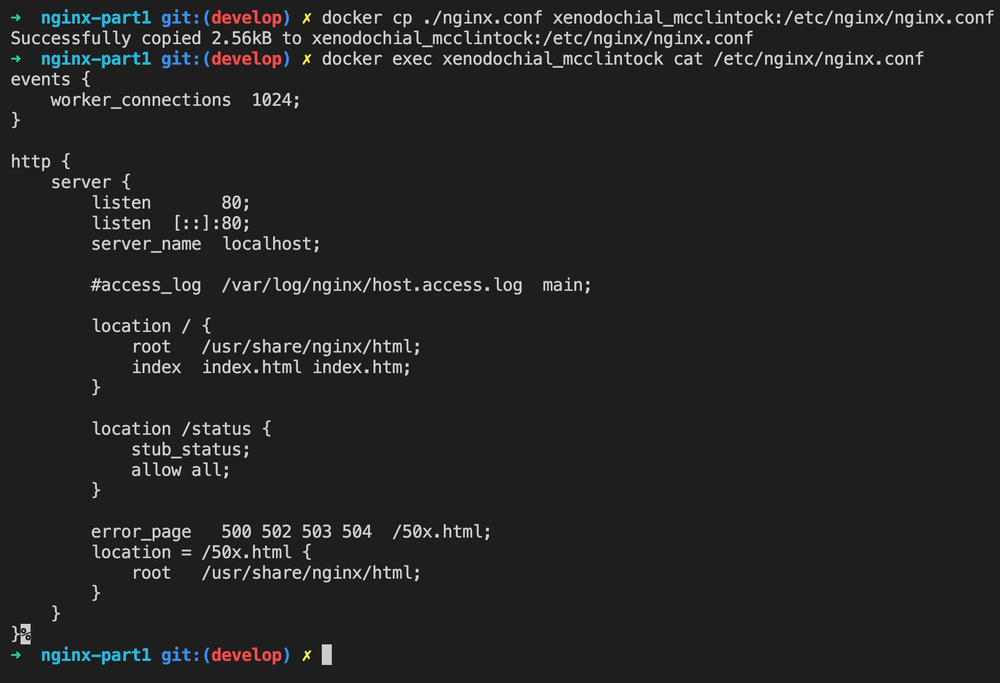

## Шаг 5 - Перезапустить nginx внутри докер образа через команду exec

Проверка правильности написания файла конфигурации
```
docker exec xenodochial_mcclintock nginx -t 
```

Перезапуск nginx
```
docker exec xenodochial_mcclintock nginx -s reload
```

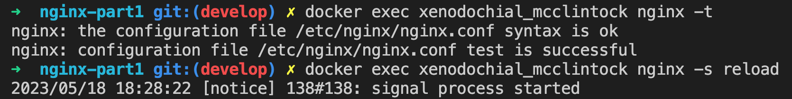

## Шаг 6 - Проверить, что по адресу localhost:80/status отдается страничка со статусом сервера nginx

```
curl localhost:80/status
```

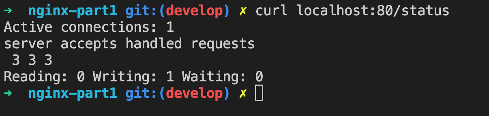

## Шаг 7 - Экспортировать контейнер в файл container.tar через команду export

```
docker export cacc4faa712f > container.tar
```

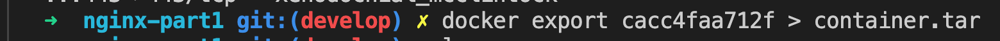

## Шаг 8 - Остановить контейнер

```
docker stop cacc4faa712f
```

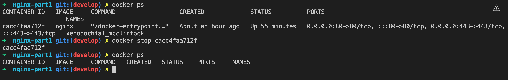

## Шаг 9 - Удалить образ через docker rmi [image_id|repository], не удаляя перед этим контейнеры

```
docker rmi -f [repository]
```

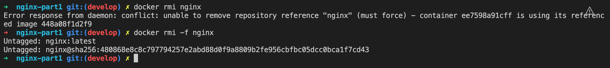

## Шаг 10 - Удалить остановленный контейнер

```
docker rmi -f [image_id]
```

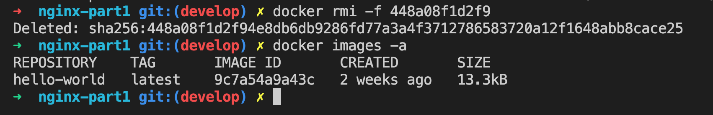

## Шаг 11 - Импортировать контейнер обратно через команду import

```
sudo docker import --change "ENTRYPOINT [\"/docker-entrypoint.sh\"]" \
--change "EXPOSE 80" \
--change "CMD [\"nginx\", \"-g\", \"daemon off;\"]" - myn:latest < container.tar
```

![sudo docker import --change "ENTRYPOINT [\"/docker-entrypoint.sh\"]" \
--change "EXPOSE 80" \
--change "CMD [\"nginx\", \"-g\", \"daemon off;\"]" - myn:latest < container.tar](./img/11.png)

## Шаг 12 - Запустить импортированный контейнер

```
sudo docker run -d -p 80:80 -p 443:443 myn
```

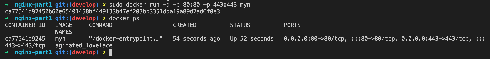

## Шаг 13 - Проверить, что по адресу localhost:80/status отдается страничка со статусом сервера nginx

```
curl localhost:80/status
```

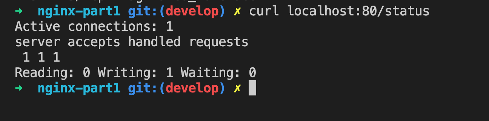

