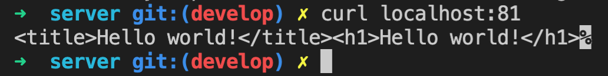

# Part 3 - делала на Linux

# Шаг 1 - Написать мини сервер на C и FastCgi, который будет возвращать простейшую страничку с надписью Hello World!

1. В папке server создадим файл server.c.
2. В него вставим код:

```
#include <fcgiapp.h>
#include <stdio.h>

int main(void) {

	while (FCGX_Accept() >= 0)
	{
    printf("Content-type: text/html\r\n");
		printf("\r\n");
		printf("<title>Hello world!</title>");
		printf("<h1>Hello world!</h1>");
	}

	return 0;
}
```

# Шаг 2 - Запустить написанный мини сервер через spawn-fcgi на порту 8080

* Запустить докер контейнер на 81 порту

```
sudo docker run -d -p 81:81 --name server-03 -it nginx /bin/bash
```

1. Перекинем server.c в docker контейнер командой:

```
docker cp server.c server-03:/
```

2. Установим необходимые библиотеки и компилятор gcc в docker container:

```
docker exec server-03 apt-get -y install libfcgi-dev spawn-fgci gcc
```

* Если выйдет ошибка при установке пакетов: "E: Unable to locate package"

```
docker exec server-03 apt-get update
```

3. Компилируем файл командой:

```
docker exec server-03 gcc server.c -o server -lfcgi
```

4. Запускаем fcgi сервер на порту 8080

```
docker exec server-03 spawn-fgci -p 8080 -n server
```

# Шаг 3 - Написать свой nginx.conf, который будет проксировать все запросы с 81 порта на 127.0.0.1:8080

1. Напишем свой nginx.conf:

```
server {
    listen			81;
    server_name 	localhost;

    location /{
        fastcgi_pass 127.0.0.1:8080;
    }

    error_page   500 502 503 504  /50x.html;
    location = /50x.html {
        root   /usr/share/nginx/html;
    }
}
```

2. Поменяем стандартные настройки nginx:

```
docker cp nginx.conf server-03:/etc/nginx/conf.d/default.conf
```

# Шаг 4 - Проверить, что в браузере по localhost:81 отдается написанная вами страничка


