## №1. Инструмент **ipcalc**

### 1.0. Поднять виртуальную машину (далее -- ws1)

1. Установка виртуальной
   машины (далее -- ws1)

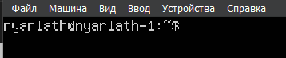

2. Установка ipcalc

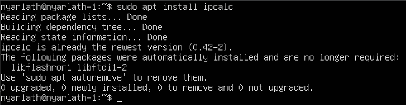

### 1.1. Сети и маски

1. Адрес сети 192.167.38.54/13
   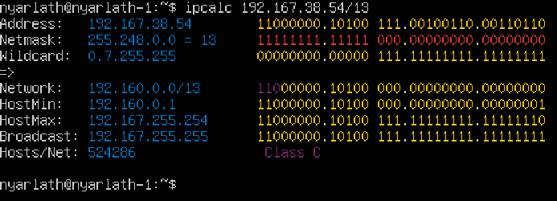
2. 

* Перевод маски 255.255.255.0 в префиксную и двоичную запись

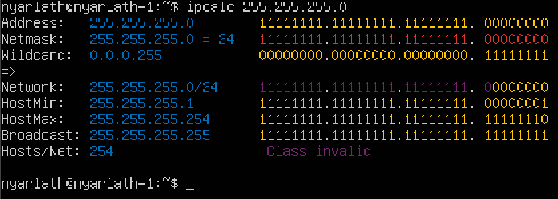

* Перевод маски /15 в обычную и двоичную

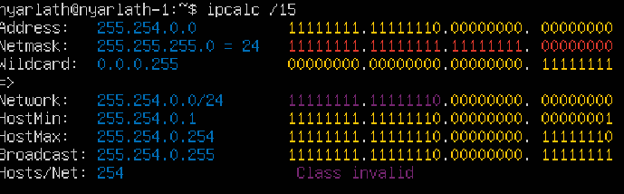

* Перевод маски 11111111.11111111.11111111.11110000 в обычную и префиксную

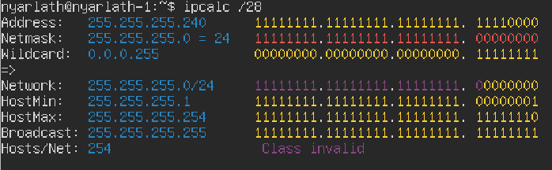

3. Минимальный и максимальный хост в сети 12.167.38.4 при масках:

* 12.167.38.4/8

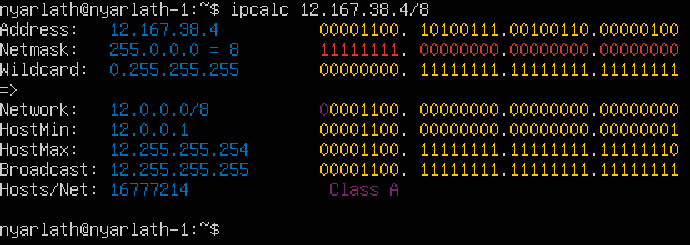

* 12.167.38.4/11111111.11111111.00000000.00000000 - 12.167.38.4/16

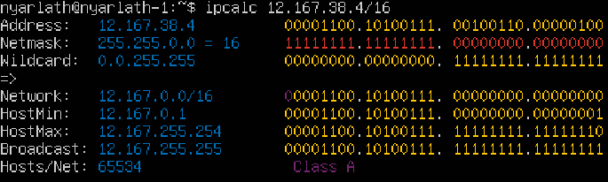

* 12.167.38.4/255.255.254.0 - 12.167.38.4/23

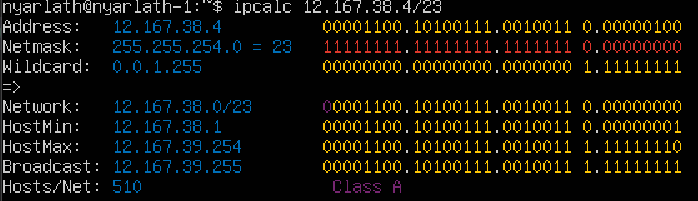

* 12.167.38.4/4

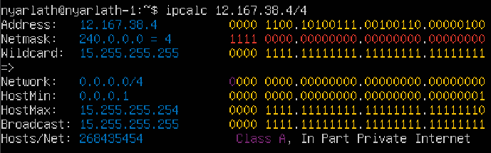

### 1.2. localhost

* Для localhost зарезервирован диапазон ip 127.0.0.1 - 127.255.255.254. Поэтому обратиться к приложению, работающем на localhost с IP
  194.34.23.100 и 128.0.0.1 мы не сможем, тогда как к IP 127.0.0.2 и 127.1.0.1 сможем.

### 1.3. Диапазоны и сегменты сетей

1. Диапазоны частных "серых" ip-адресов: \
   - 10.0.0.0 - 10.255.255.255 \
   - 172.16.0.0 - 172.31.255.255 \
   - 192.168.0.0 - 192.168.255.255Поэтому:
   - 10.0.0.45 - Частный
   - 134.43.0.2 - Публичный
   - 192.168.4.2 - Частный
   - 172.20.250.4 - Частный
   - 172.0.2.1 - Публичный
   - 192.172.0.1 - Публичный
   - 172.68.0.2 - Публичный
   - 172.16.255.255 - Частный
   - 10.10.10.10 - Частный
   - 192.169.168.1 - Публичный
2. Шлюзы, возможные у сети 10.10.0.0/18:

- 10.10.0.2
- 10.10.10.10
- 10.10.1.255

## №2. Статическая маршрутизация между двумя машинами

### 2.0. Поднять две виртуальные машины (далее -- ws1 и ws2)

0. Поднять две виртуальные мащины

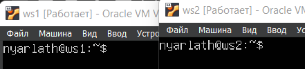

1. С помощью команды ip a посмотреть существующие сетевые интерфейсы

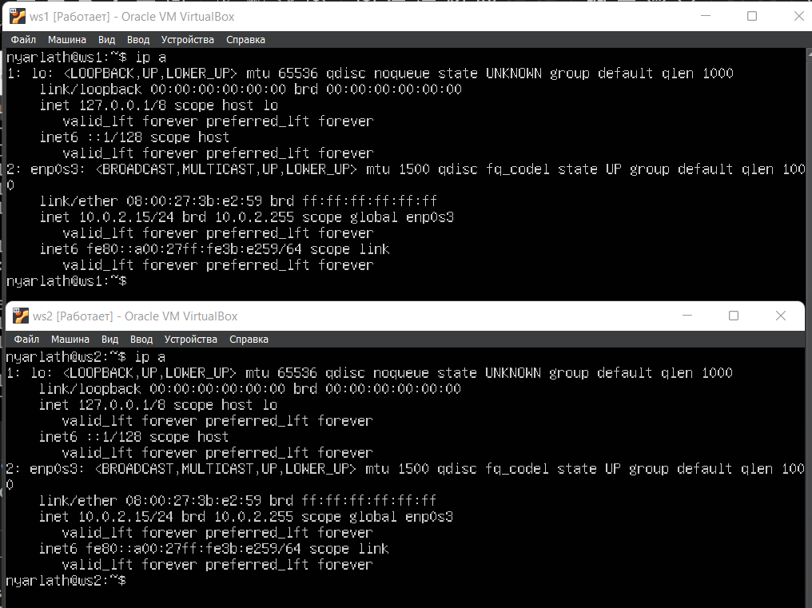

2. Описать сетевой интерфейс, соответствующий внутренней сети, на обеих машинах и задать следующие адреса и маски:

* ws1 - 192.168.100.10, маска /16

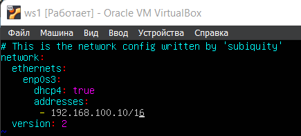

* ws2 - 172.24.116.8, маска /12

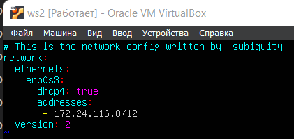

3. Выполнить команду netplan apply для перезапуска сервиса сети

* ws1

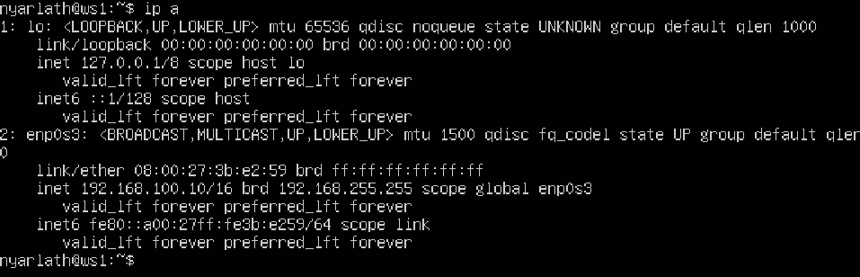

* ws2

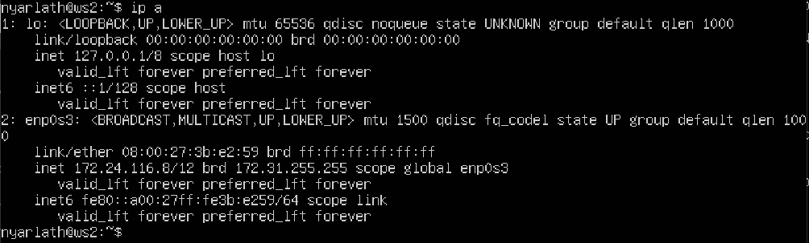

### 2.1. Добавление статического маршрута вручную

1. Добавление статического маршрута от машины ws1 к ws2. Вывод результата пингования

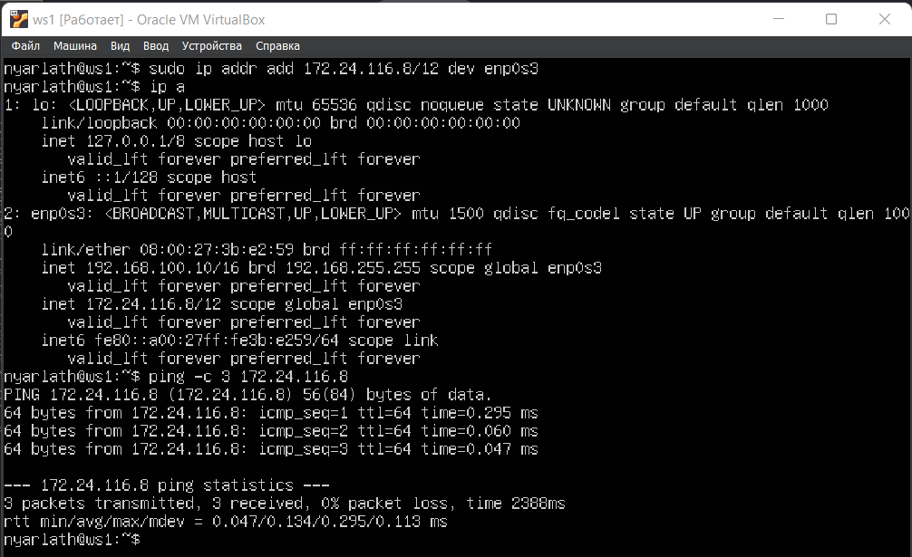

2. Добавление статического маршрута от машины ws2 к ws1. Вывод результата пингования

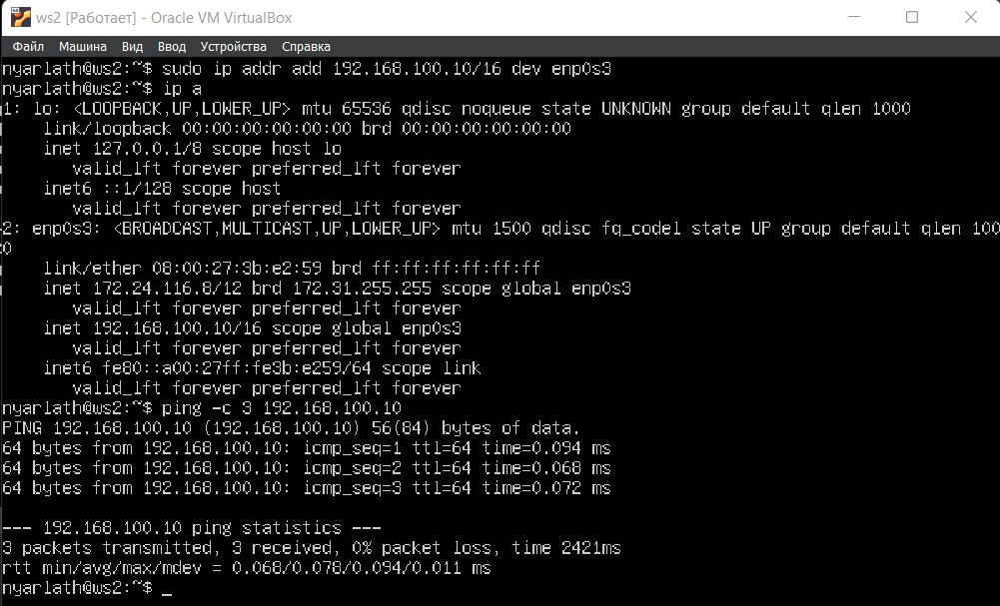

### 2.2. Добавление статического маршрута с сохранением

* Перезапустить машины

``reboot``

1. Добавить статический маршрут от одной машины до другой с помощью файла etc/netplan/00-installer-config.yaml

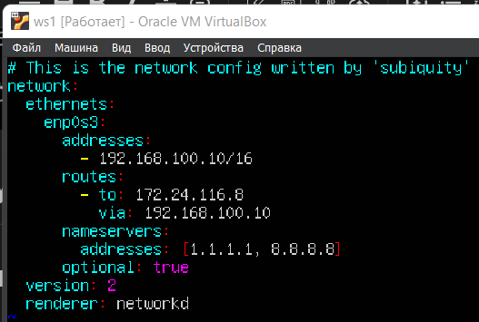

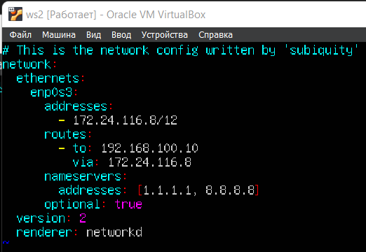

* Принимаем изменения

``sudo netplan apply``

2. Пропинговать соединение между машинами

* Проверка соединения ws1 с ws2

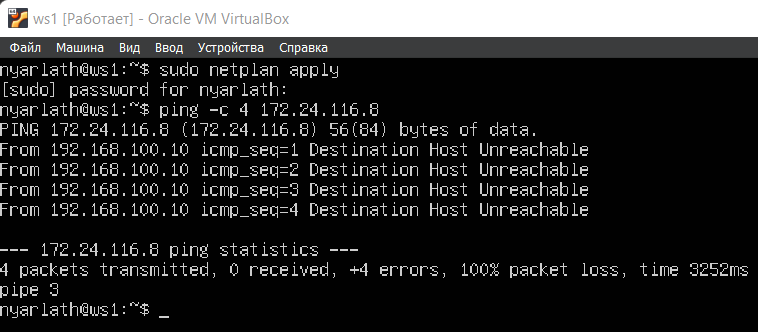

* Проверка соединения ws2 с ws1

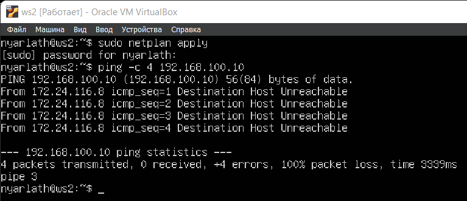

## №3. Утилита iperf3

### 3.1. Скорость соединения

- 8 Mpbs = 1 MB/s
- 100 MB/s = 819200 Kbps
- 1 Gbps = 1024 Mbps

### 3.2. Утилита iperf3

#### Измерить скорость соединения между ws1 и ws2

1. ws1 - сервер, ws2 - клиент

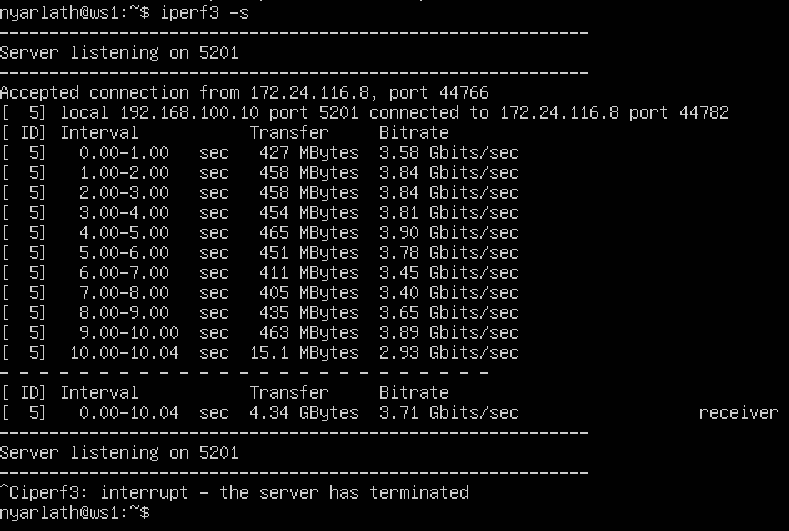


2. ws2 - сервер, ws1 - клиент

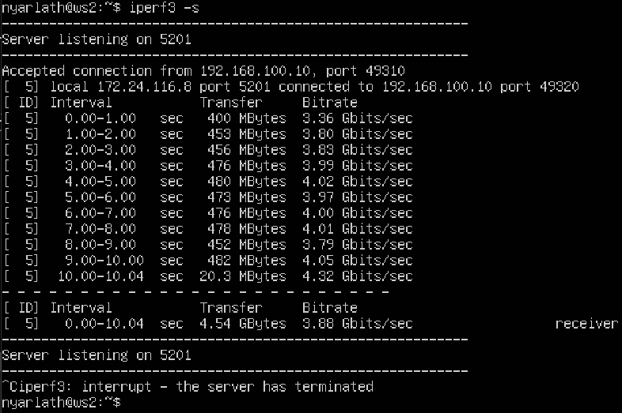

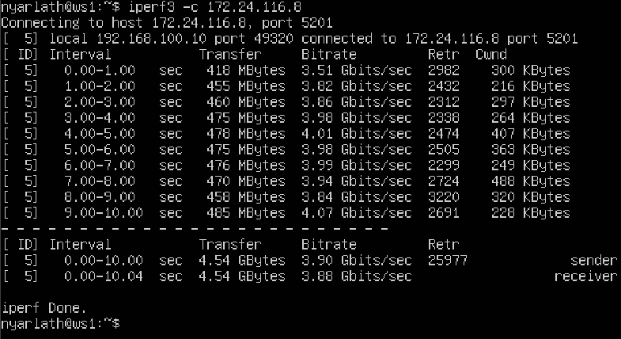

## №4. Сетевой экран

### 4.1. Утилита iptables

- /etc/firewall ws1

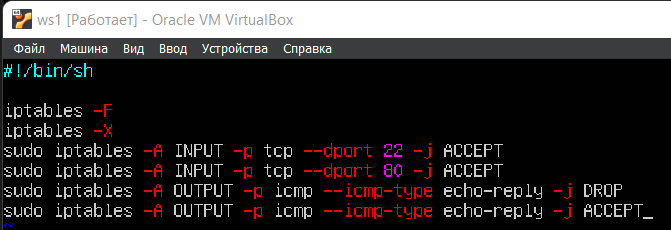

- /etc/firewall ws2

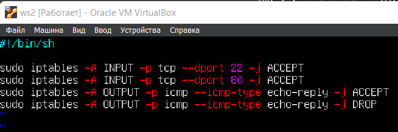

* DROP — молча игнорирует пакет и прекращает обработку правил в этой цепочке.
* ACCEPT — принимает пакет и останавливает обработку правил в этой цепочке.
* Запуск файлов на ws1

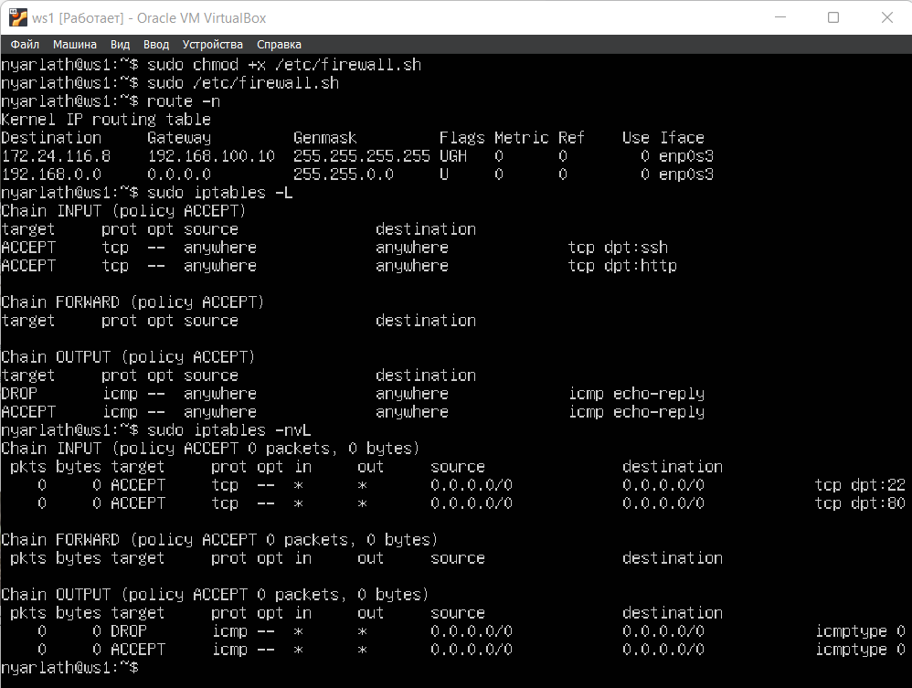

* Запуск файлов на ws2

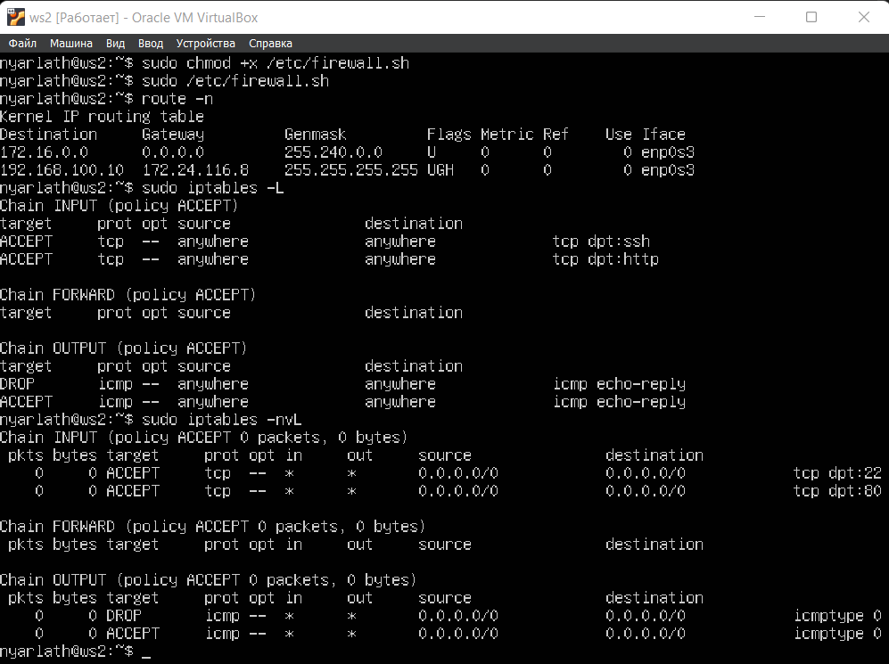

- Стратегия для ws1:

1) на ws1 применить стратегию когда в начале пишется запрещающее правило, а в конце пишется разрешающее правило (это касается пунктов 3 и 4)
2) открыть на машинах доступ для порта 22 (ssh) и порта 80 (http)
3) запретить *echo reply* (машина не должна "пинговаться”, т.е. должна быть блокировка на OUTPUT)
4) разрешить *echo reply* (машина должна "пинговаться")

- Стратегия для ws2:

1) на ws2 применить стратегию когда в начале пишется разрешающее правило, а в конце пишется запрещающее правило (это касается пунктов 3 и 4)
2) открыть на машинах доступ для порта 22 (ssh) и порта 80 (http)
3) разрешить *echo reply* (машина должна "пинговаться")
4) запретить *echo reply* (машина не должна "пинговаться”, т.е. должна быть блокировка на OUTPUT)

* Разница между стратегиями заключается в том, что они выполняются сверху вниз, то есть, если правило запрета выше, оно работает, а правило разрешения ниже, оно не работает.

### 4.2. Утилита nmap

Командой ping найти машину, которая не "пингуется", после чего утилитой nmap показать, что хост машины запущен
Проверка: в выводе nmap должно быть сказано: Host is up

* Проверка виртуальной машины ws2 на pingование

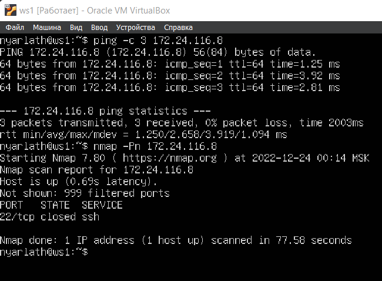

* Проверка виртуальной машины ws1 на pingование

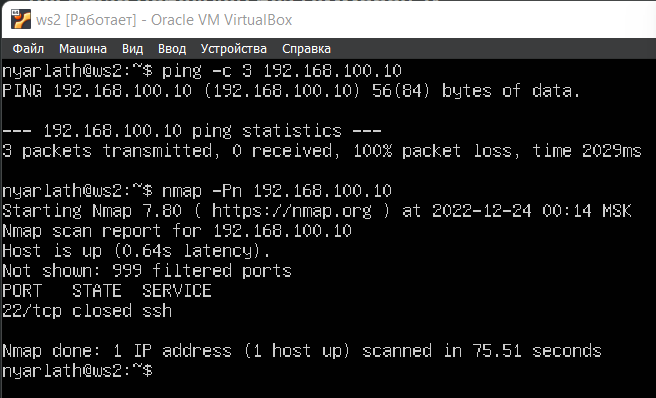

* Сохранение образов виртуальных машин:

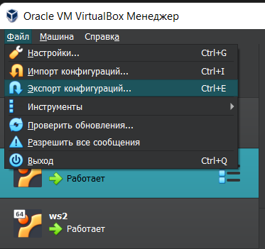

## №5. Статическая маршрутизация сети

### 5.0. Поднять пять виртуальных машин (3 рабочие станции (ws11, ws21, ws22) и 2 роутера (r1, r2))

### 5.1. Настройка адресов машин

1. Настройка конфигурации машин в etc/netplan/00-installer-config.yaml согласно сети на рисунке.

Перезапустить сервис сети. Если ошибок нет, то командой ip -4 a проверить, что адрес машины задан верно. Также пропинговать ws22 с ws21. Аналогично пропинговать r1 с ws11.

* рисунок


* ws11

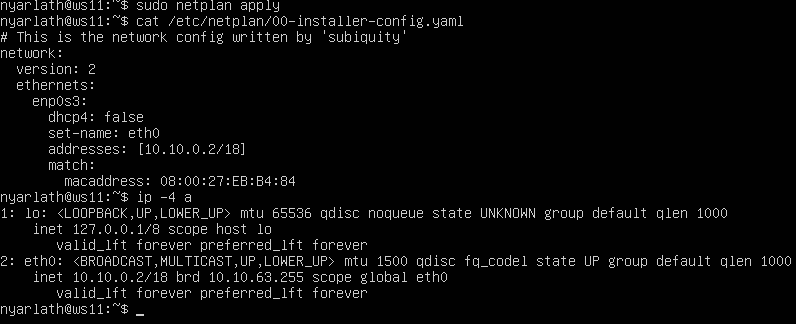

* ws21

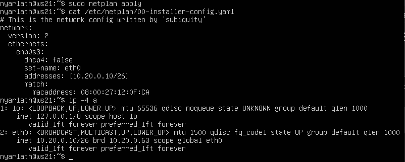

* ws22


* r1

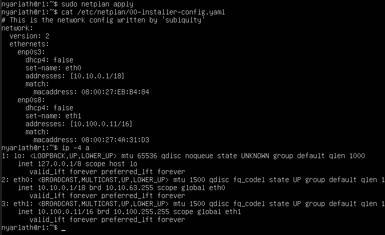

* r2

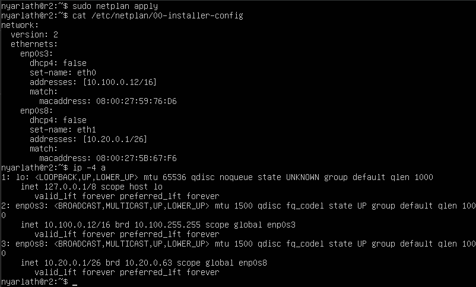

* ping ws21 with ws22


* ping ws11 with r1

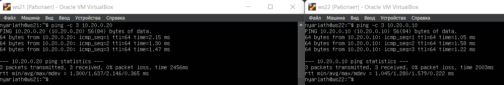

### 5.2. Включение переадресации IP-адресов.

1. Для включения переадресации IP, выполните команду на роутерах:

```
sysctl -w net.ipv4.ip_forward=1
```

* r1

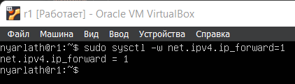

* r2

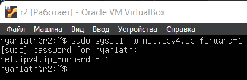

* При таком подходе переадресация не будет работать после перезагрузки системы.

2. Откройте файл /etc/sysctl.conf и добавьте в него следующую строку:
   net.ipv4.ip_forward = 1
   При использовании этого подхода, IP-переадресация включена на постоянной основе.

* r1

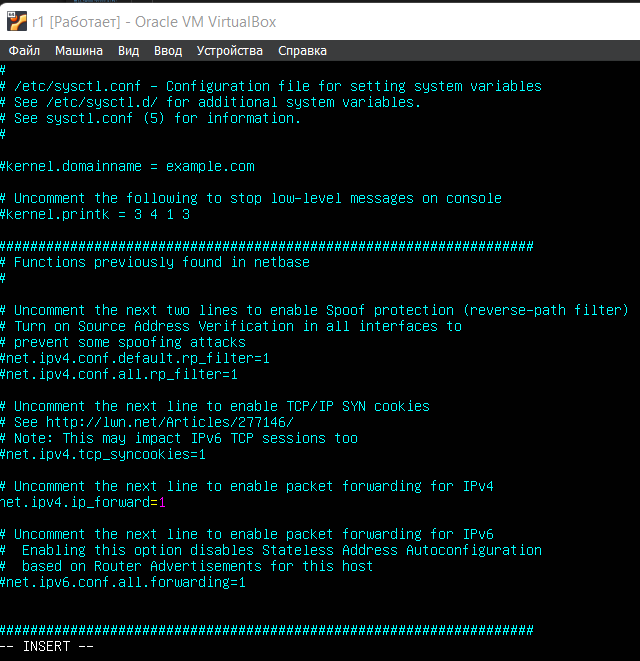

* r2

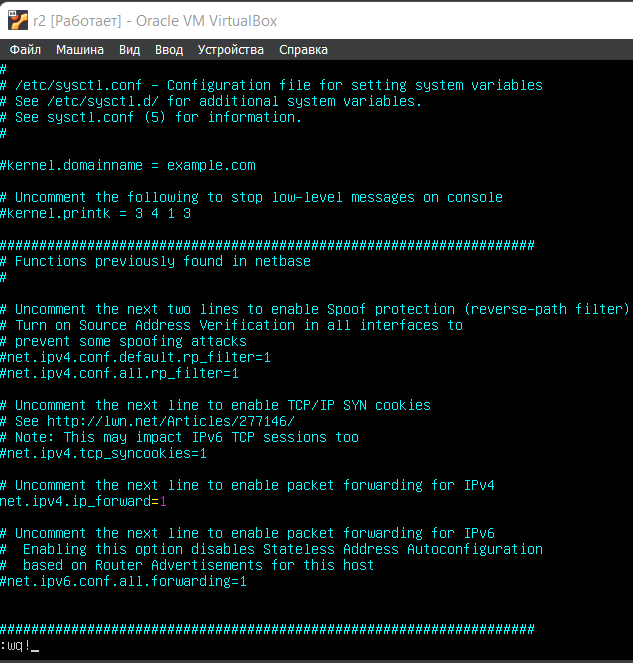

### 5.3. Установка маршрута по-умолчанию

Пример вывода команды ip r после добавления шлюза:
default via 10.10.0.1 dev eth0
10.10.0.0/18 dev eth0 proto kernel scope link src 10.10.0.2

1. Настроить маршрут по-умолчанию (шлюз) для рабочих станций. Для этого добавить default перед IP роутера в файле конфигураций. Вызвать ip r и показать, что добавился маршрут в таблицу маршрутизации.

* ws11

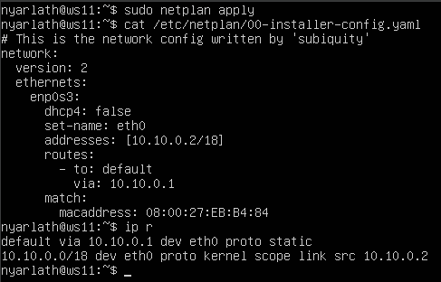

* ws21

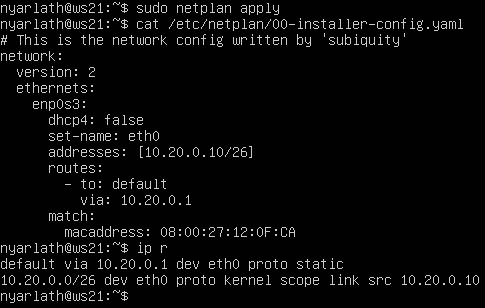

* ws22

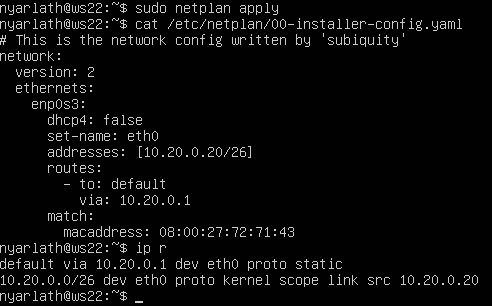

* r2

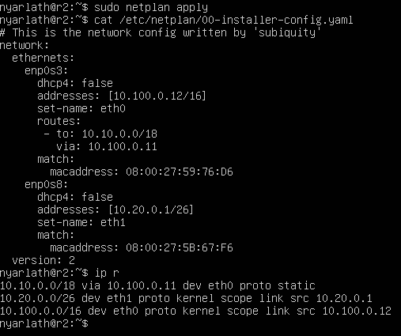

2. Пропинговать с ws11 роутер r2 и показать на r2, что пинг доходит. Для этого использовать команду:
   tcpdump -tn -i eth0

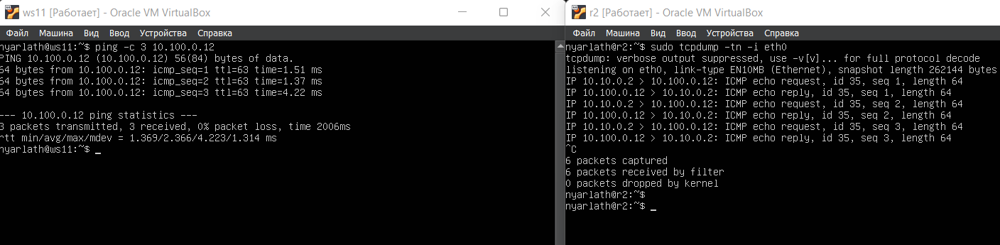

### 5.4. Добавление статических маршрутов

1. Добавить в роутеры r1 и r2 статические маршруты в файле конфигураций. Пример для r1 маршрута в сетку 10.20.0.0/26:

```
# Добавить в конец описания сетевого интерфейса eth1:
- to: 10.20.0.0
  via: 10.100.0.12
```

* Вызвать ip r и показать таблицы с маршрутами на обоих роутерах. Пример таблицы на r1:
  10.100.0.0/16 dev eth1 proto kernel scope link src 10.100.0.11
  10.20.0.0/26 via 10.100.0.12 dev eth1
  10.10.0.0/18 dev eth0 proto kernel scope link src 10.10.0.1
* r1

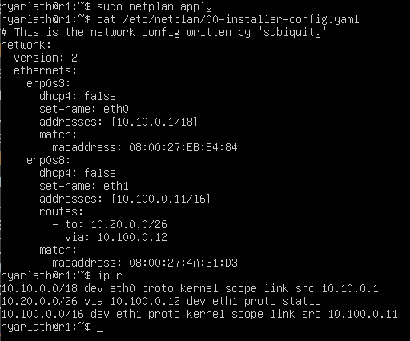

* r2

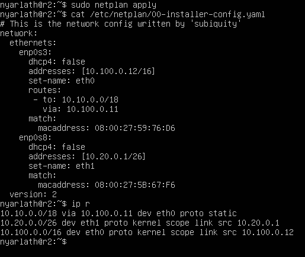

2. Запустить команды на ws11:
   ip r list 10.10.0.0/[маска сети] и ip r list 0.0.0.0/0

![ws11: ip r list 10.10.0.0/[маска сети] и ip r list 0.0.0.0/0](assets/5.4.3.png)

* Для адреса 10.10.0.0/[порт сети] был выбран маршрут, отличный от 0.0.0.0/0, чтобы точно указать адрес подсети. Другими словами, адрес 0.0.0.0/0 включает все хосты всех сетей и, когда пакеты отправляются хосту из подсети 10.10.0.0/18, они бы просто не доходили, так как у них точного адреса назначения.

### 5.5. Построение списка маршрутизаторов

Пример вывода утилиты traceroute после добавления шлюза:

```
1 10.10.0.1 0 ms 1 ms 0 ms
2 10.100.0.12 1 ms 0 ms 1 ms
3 10.20.0.10 12 ms 1 ms 3 ms
```

Запустить на r1 команду дампа:

```
tcpdump -tnv -i eth0
```

# Установить пакет sudo apt install traceroute

* Скриншот с выводом команды `traceroute` на ws11:

При помощи утилиты traceroute построить список маршрутизаторов на пути от ws11 до ws21

- Скриншот с выводом команды `traceroute` на ws11:

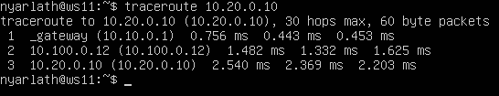

- Скриншот с вызовом команды `tcpdump` на r1. Так как вывод команды не умещается на один экран, сделал пренаправление в файл:


- Первая часть вывода `tcpdump`

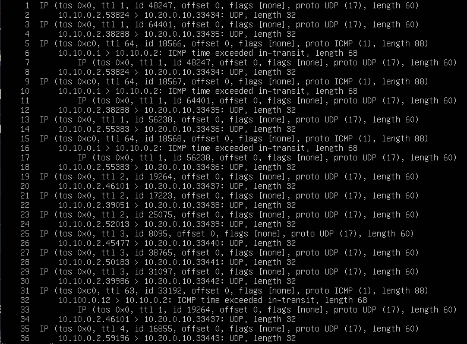

- Вторая часть вывода `tcpdump`

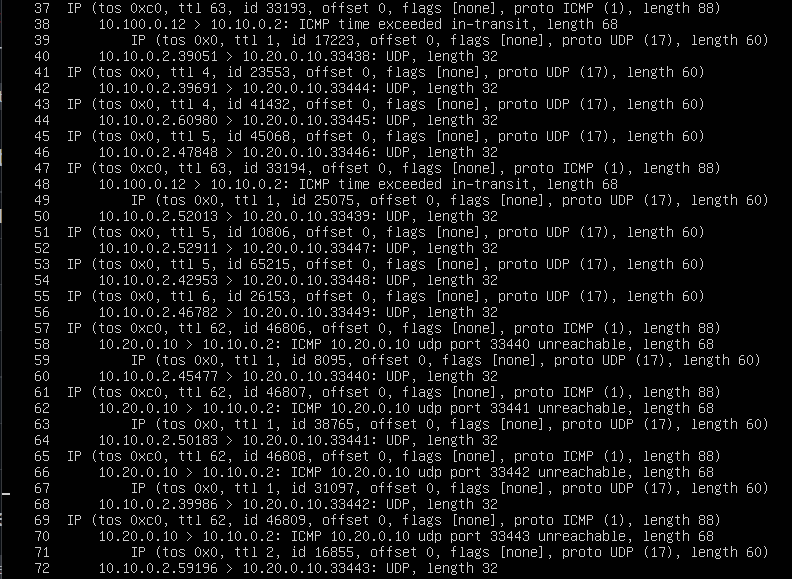

- Третья часть вывода `tcpdump`

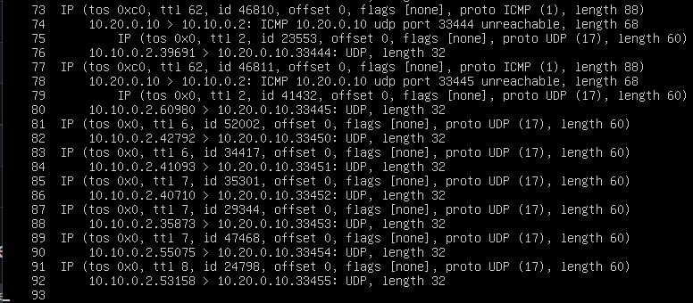

* Принцип работы построения пути при помощи **traceroute**.
  Первоначальный хост, с которого запускается команда, отправляет серию пакетов с ttl = 1.
  ttl - время жизни пакета, характеризующееся количеством хостов, через которое должен пройти пакет, прежде чем будет удалён.
  Первый пакет отправляется с ttl = 1, достигая первого маршрутизатора, он будет удалён, и маршрутизатор отправляет ICMP-сообщение: "time exceeded in-transit".
  Получив подобное сообщение сообщение, traceroute увеличивает ttl следующих пакетов на 1.
  traceroute отправляет пакеты на порты, которые заведомо не используются, поэтому, когда пакет достигнет адреса назначения, хост отправит сообщение типа "udp port 33440 unreachable".
  Получив подобное сообщение traceroute завершает свою работу.

### 5.6. Использование протокола ICMP при маршрутизации

* Запустить на r1 перехват сетевого трафика, проходящего через eth0 с помощью команды:

```
tcpdump -n -i eth0 icmp
```

* Пропинговать с ws11 несуществующий IP (например, 10.30.0.111) с помощью команды:
  ping -c 1 10.30.0.111

- Скриншот с вызовом и выводом указанной команды на роутере r1:

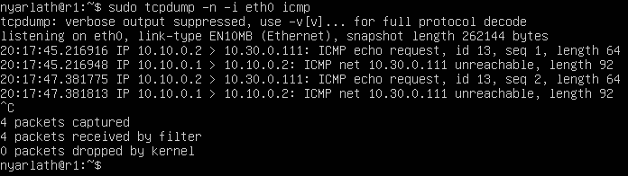

- Скриншот с пингом несуществующего в подсетях проекта адреса 10.30.0.111:

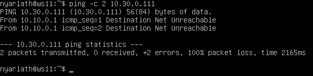

## №6. Динамическая настройка IP с помощью **DHCP**

`-` Следующим нашим шагом будет более подробное знакомство со службой **DHCP**, которую ты уже знаешь.

**== Задание ==**

*В данном задании используются виртуальные машины из Части 5*

### 6.1. Для r2 настроить в файле */etc/dhcp/dhcpd.conf* конфигурацию службы **DHCP**:

##### 1) указать адрес маршрутизатора по-умолчанию, DNS-сервер и адрес внутренней сети. Пример файла для r2:

```shell
subnet 10.100.0.0 netmask 255.255.0.0 {}

subnet 10.20.0.0 netmask 255.255.255.192
{
    range 10.20.0.2 10.20.0.50;
    option routers 10.20.0.1;
    option domain-name-servers 10.20.0.1;
}
```

##### 2) в файле *resolv.conf* прописать `nameserver 8.8.8.8.`

- На скриншотах ниже представлено содержание изменённых файлов на r2:

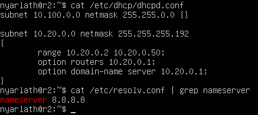

### 6.2. Перезагрузить службу **DHCP** командой `systemctl restart isc-dhcp-server`. Машину ws21 перезагрузить при помощи `reboot` и через `ip a` показать, что она получила адрес. Также пропинговать ws22 с ws21.

- Скриншот с перезапуском службы DHCP:

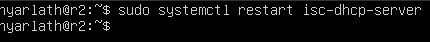

- На скриншоте спомощью команды ``sudo service isc-dhcp-server status`` показана активация сервера на r2:

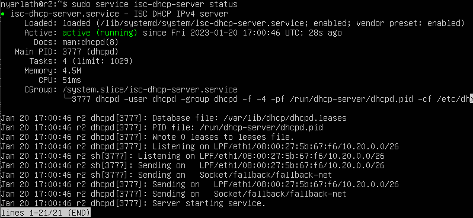

- Пинг ws22 c ws21:

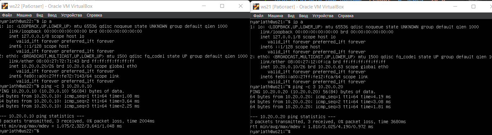

### 6.3. Указать MAC адрес у ws11, для этого в *etc/netplan/00-installer-config.yaml* надо добавить строки: `macaddress: 10:10:10:10:10:BA`, `dhcp4: true`

- На скриншоте ниже представлено содержание изменённого файла *etc/netplan/00-installer-config.yaml*.

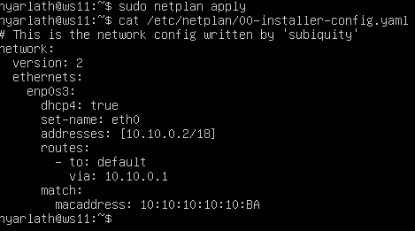

### 6.4. Для r1 настроить аналогично r2, но сделать выдачу адресов с жесткой привязкой к MAC-адресу (ws11). Провести аналогичные тесты

- На скриншотах ниже представлено содержание изменённых файлов на r2:

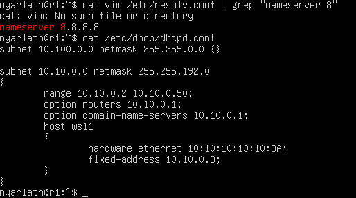

- Скриншот c ip до перезапуска службы:

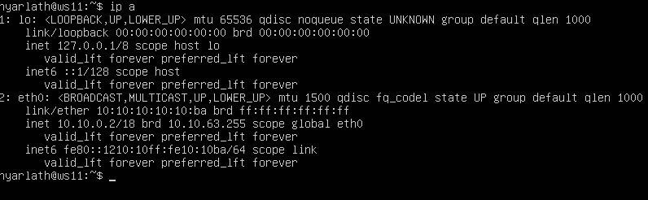

- Скриншот с перезапуском службы DHCP с активацией сервера:

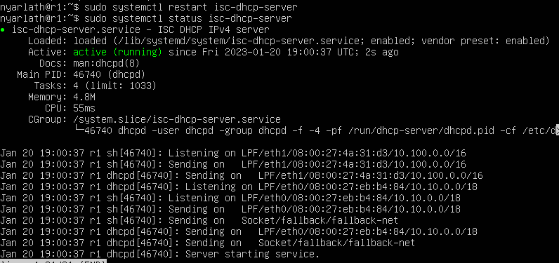

- Скриншот c ip после перезапуска службы и ребута машины:

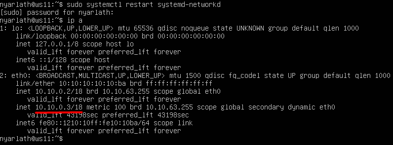

- Пинг r1 c ws11:

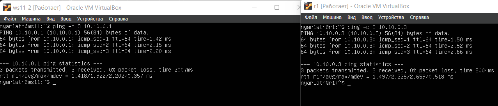

### 6.5. Запросить с ws21 обновление ip адреса

- ip до обновления - null:

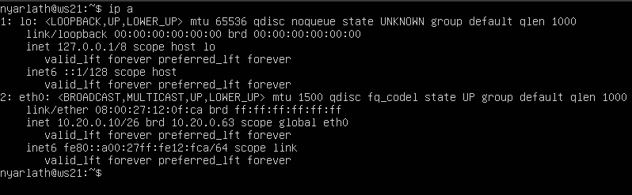

- вызов команды `dhclient -r eth0`, чтобы очистить адреса на интерфейсе eth0:

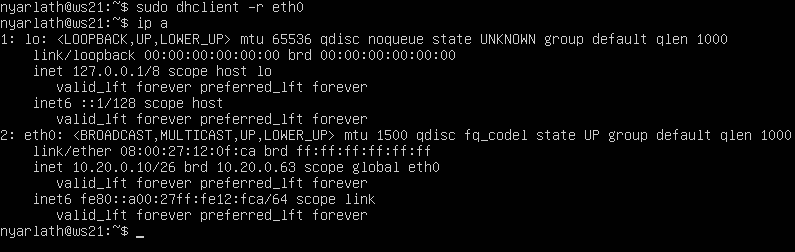

- вызов команды `dhclient -v eth0`, чтобы запросить новый адрес от сервера:


- ip после обновления - 10.20.0.3:

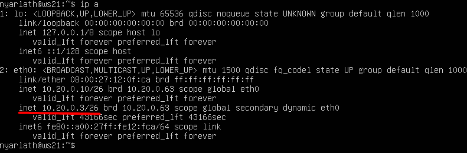

## №7. **NAT**

`-` Ну и, наконец, в качестве вишенки на торте, я расскажу тебе про механизм преобразования адресов.

**== Задание ==**

*В данном задании используются виртуальные машины из Части 5*

### 7.1. В файле */etc/apache2/ports.conf* на ws22 и r1 изменить строку `Listen 80` на `Listen 0.0.0.0:80`, то есть сделать сервер Apache2 общедоступным

* Перед этим установить apache2

- На скриншотах ниже представлено содержание изменённых файлов:
   - на ws22:

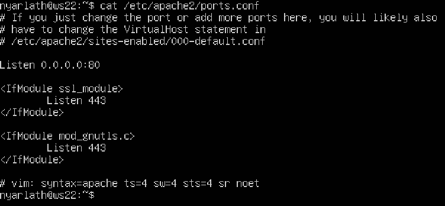

   - r1:

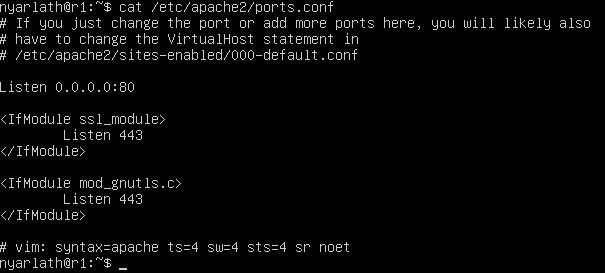

##### Запустить веб-сервер Apache командой `service apache2 start` на ws22 и r1

- На скриншотах ниже представлен запуск:
   - на ws22:
   
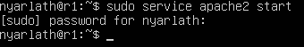
   
   - r1:
  
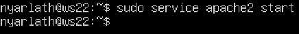

### 7.2. Добавить в фаервол, созданный по аналогии с фаерволом из Части 4, на r2 следующие правила:

##### 1) Удаление правил в таблице filter - `iptables -F`

##### 2) Удаление правил в таблице "NAT" - `iptables -F -t nat`

##### 3) Отбрасывать все маршрутизируемые пакеты - `iptables --policy FORWARD DROP`

##### Запускать файл также, как в Части 4

- Создала и запустила фаервол на r2:


### 7.3. Проверить соединение между ws22 и r1 командой `ping`

*При запуске файла с этими правилами, ws22 не должна "пинговаться" с r1*

На скриншотах ниже представлен вывод команды ping:
- с r1 до ws22:

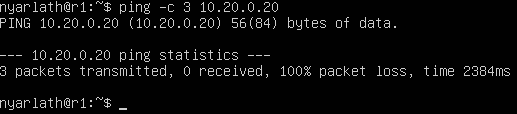

- с ws22 до r1:

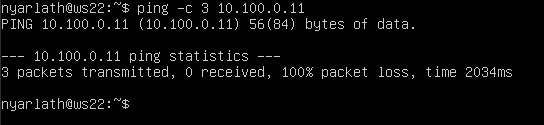

### 7.4. Добавить в файл ещё одно правило:

##### 4) Разрешить маршрутизацию всех пакетов протокола **ICMP**

##### Запускать файл также, как в Части 4

- Дописала правила и запустила фаервол на r2:

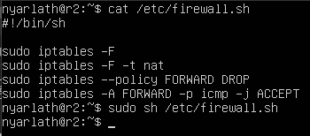

##### Проверить соединение между ws22 и r1 командой `ping`

*При запуске файла с этими правилами, ws22 должна "пинговаться" с r1*

На скриншотах ниже представлен вывод команды ping:
- с r1 до ws22:

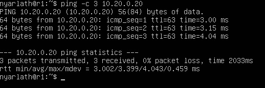

- с ws22 до r1:

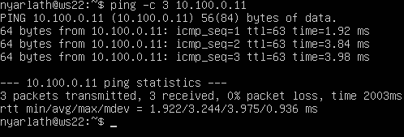

### 7.5. Добавить в файл ещё два правила:

##### 5) Включить **SNAT**, а именно маскирование всех локальных ip из локальной сети, находящейся за r2 (по обозначениям из Части 5 - сеть 10.20.0.0)

*Совет: стоит подумать о маршрутизации внутренних пакетов, а также внешних пакетов с установленным соединением*

##### 6) Включить **DNAT** на 8080 порт машины r2 и добавить к веб-серверу Apache, запущенному на ws22, доступ извне сети

*Совет: стоит учесть, что при попытке подключения возникнет новое tcp-соединение, предназначенное ws22 и 80 порту*

- Дописала правила и запустила фаервол на r2:

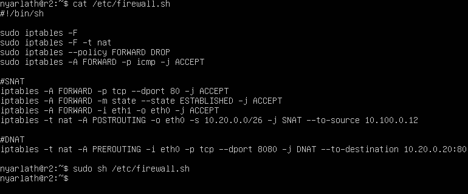

- Прописала в /etc/apache2/ports.conf прослушку 8080 порта на машинах r1, r2, ws22

##### Запускать файл также, как в Части 4

*Перед тестированием рекомендуется отключить сетевой интерфейс **NAT** (его наличие можно проверить командой `ip a`) в VirtualBox, если он включен*

##### Проверить соединение по TCP для **SNAT**, для этого с ws22 подключиться к серверу Apache на r1 командой:

`telnet [адрес] [порт]`

##### Проверить соединение по TCP для **DNAT**, для этого с r1 подключиться к серверу Apache на ws22 командой `telnet` (обращаться по адресу r2 и порту 8080)

На скриншотах ниже представлен вывод команды telnet:
- с r1 до ws22:

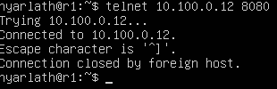

- с ws22 до r1:

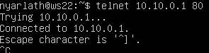

## №8. Дополнительно. Знакомство с **SSH Tunnels**

**== Задание ==**

*В данном задании используются виртуальные машины из Части 5*

##### Запустить на r2 фаервол с правилами из Части 7

##### Запустить веб-сервер **Apache** на ws22 только на localhost (то есть в файле */etc/apache2/ports.conf* изменить строку `Listen 80` на `Listen localhost:80`)

##### Воспользоваться *Local TCP forwarding* с ws21 до ws22, чтобы получить доступ к веб-серверу на ws22 с ws21

##### Воспользоваться *Remote TCP forwarding* c ws11 до ws22, чтобы получить доступ к веб-серверу на ws22 с ws11

##### Для проверки, сработало ли подключение в обоих предыдущих пунктах, перейдите во второй терминал (например, клавишами Alt + F2) и выполните команду:

`telnet localhost [локальный порт]`

- Запустила фаервол на r2:

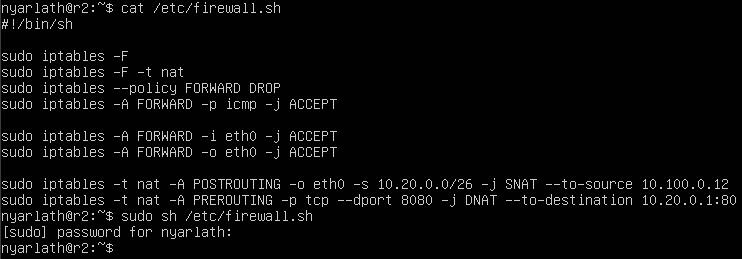

- На ws22 изменила порт Apache2 на localhost:80 и перезапустил сервер:

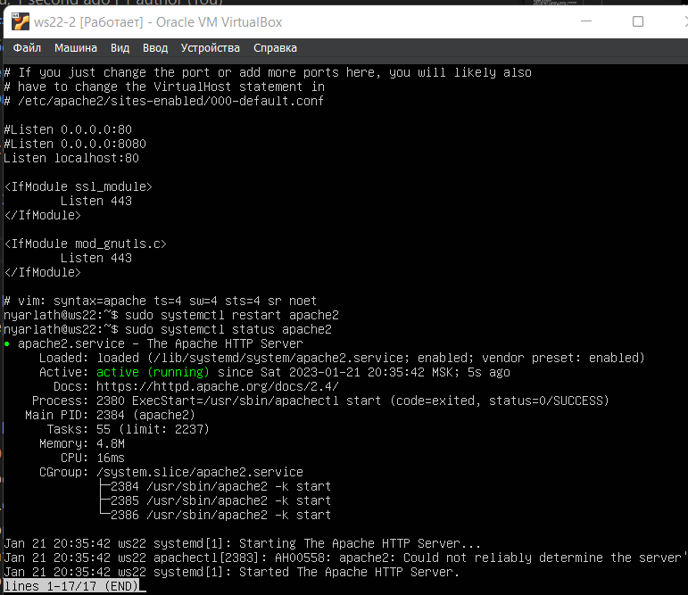

- Поскольку порт должен открыться на удалённой машине, команду telnet для проверки порта выполнил на ws22:

