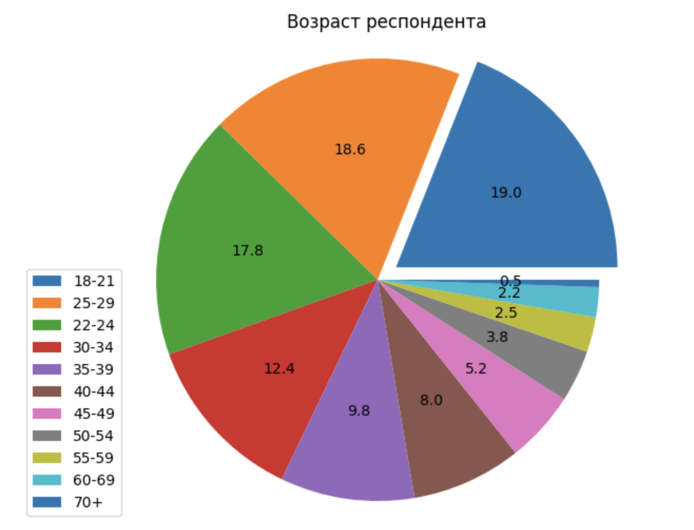
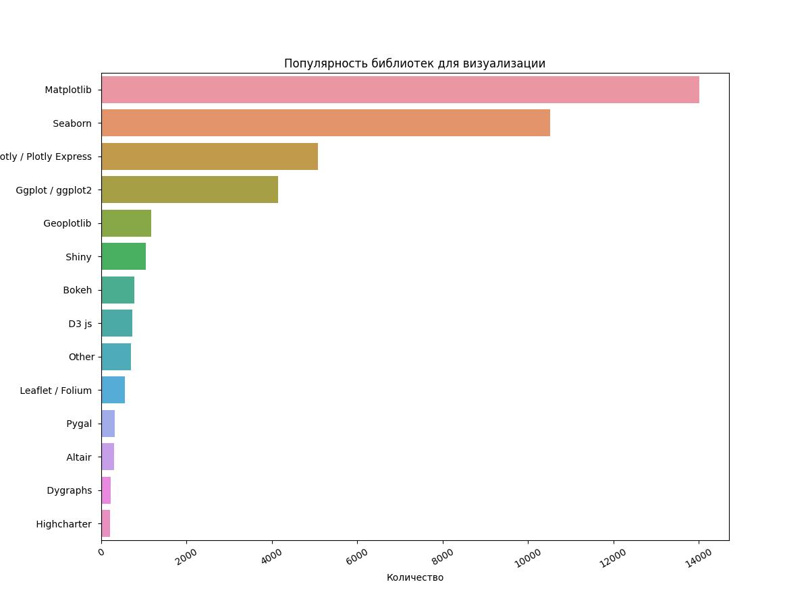
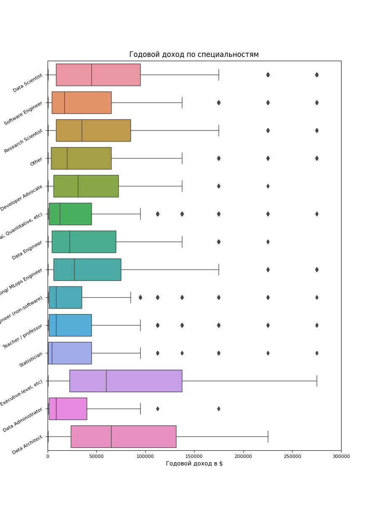
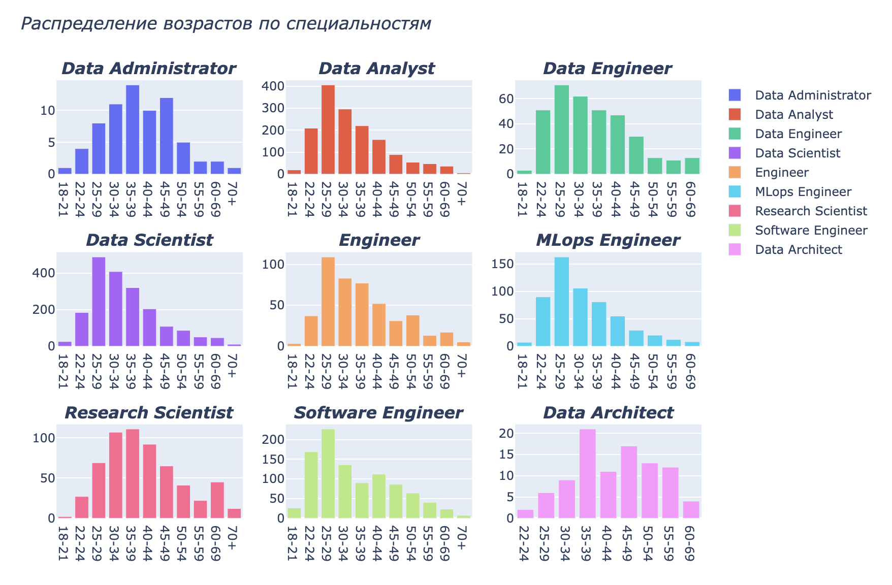
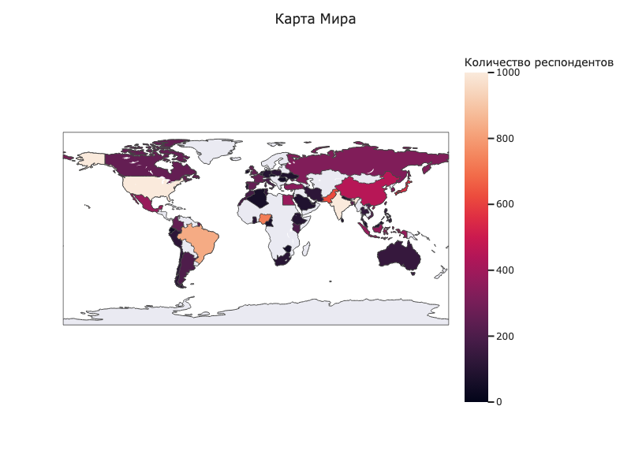

# Day 03 – Визуализация данных

### Преамбула

В области анализа данных визуализация данных - это не просто создание множества красивых графиков для отчетности.
Она широко используется в повседневной работе на всех этапах проекта.  Начнем с того, что визуальное
исследование данных - это первое, что человек должен сделать при решении новой задачи. Мы проводим предварительный
анализ, используя графики и таблицы, чтобы обобщить данные и опустить менее важные детали.
Нам, людям, гораздо удобнее уловить основные моменты, рассматривая графики, нежели читать много строк необработанных данных.
Удивительно, как много информации можно почерпнуть из, казалось бы, простых графиков, созданных с помощью
доступных инструментов визуализации. Далее, когда мы анализируем работу модели или сообщаем о результатах,
мы также часто используем графики и изображения.

В целом, визуализация - это относительно быстрый способ узнать что-то новое о данных. Поэтому крайне важно изучить
ее наиболее полезные приемы и сделать их частью твоего повседневного набора инструментов для анализа данных.

### Общая инструкция

Методология Школы 21 может быть не похожа на тот образовательный опыт, который случался с тобой ранее. Её отличает высокий уровень автономии: у тебя есть задача, ты должен её выполнить. По большей части тебе нужно будет самому добывать знания для её решения. Второй важный момент — это peer-to-peer обучение. В образовательном процессе нет менторов и экспертов, перед которыми ты защищаешь свой результат. Ты это делаешь перед таким же учащимися, как и ты сам. У них есть чек-лист, который поможет им качественно выполнить приемку вашей работы.

Роль Школы 21 заключается в том, чтобы обеспечить через последовательность заданий и оптимальный уровень поддержки такую траекторию обучения, при которой ты не только освоишь hard skills, но и научишься самообучаться.

- Не доверяй слухам и предположениям о том, как должно быть оформлено ваше решение. Этот документ является единственным источником, к которому стоит обращаться по большинству вопросов;
- твое решение будет оцениваться другими учащимися;
- подлежат оцениванию только те файлы, которые ты выложил в GIT (ветка develop, папка src);
- в твоей папке не должно быть лишних файлов — только те, что были указаны в задании;
- не забывай, что у вас есть доступ к интернету и поисковым системам;
- обсуждение заданий можно вести и в Slack;
- будь внимателен к примерам, указанным в этом документе — они могут иметь важные детали, которые не были оговорены другим способом;
- и да пребудет с тобой Сила!

### Цели

Цель данного проекта - познакомиться с инструментами визуализации данных c помощью популярных библиотек
matplotlib, seaborn и plotly. Данные с которыми мы будем работать - это также данные с опроса участников сообщества
[Kaggle](https://www.kaggle.com) за 2022 год.

### Задание

Для начала:

* Открой документацию библиотек [matplotlib](https://matplotlib.org/stable/gallery/index),
  [seaborn](https://seaborn.pydata.org/examples/index.html), [plotly](https://plotly.com/python/).
  В каждой из них есть подробные туториалы и примеры построения графиков.
* Отрой файл 03-visualization-assignment.ipynb и приступай к выполнению задания.

**Задания**:

1. Используя библиотеку matplotlib, построй круговую диаграмму (Pie plot) для возраста респондента.
   График должен быть точно такой же, как показано ниже (и по значениям, и по стилю):
   
2. Используя библиотеку seaborn, построй столбцовую диаграмму (Bar plot) по популярности библиотек для визуализации.
   График должен быть точно такой же, как показано ниже (и по значениям, и по стилю):
   
3. Используя библиотеку seaborn, построй диаграмму "Ящик с усами" (Box plot) заработка по различным специальностям.
   График должен быть точно такой же, как показано ниже (и по значениям, и по стилю):
   
4. Используя библиотеку plotly, построй столбцовую диаграмму (Bar plot) на распределение респондентов по возрасту по
   специальностям Data Administrator, Data Analyst, Data Engineer, Data Scientist, Engineer, MLops Engineer,
   Research Scientist, Software Engineer, Data Architect
   График должен быть точно такой же, как показано ниже (и по значениям, и по стилю):
   
5. Используя библиотеку plotly, построй карту стран респондентов. В этом вам поможет [plotly.choropleth](https://plotly.com/python/choropleth-maps/)
   График должен быть точно такой же, как показано ниже (и по значениям, и по стилю):
   
6. *Дополнительное задание: Одна из самых красивых и динамичных визуализаций - это [Bar Chart Race](https://pypi.org/project/bar-chart-race/).
   Выбери данные, которые интересно было бы визуализировать с помощью этой библиотеки, и поделись с ним со своими одногруппниками.
   Загрузи итоговую визуализацию на гит в формате .gif
   Дополнительные ресурсы для обучения мы привели в файле [reading_list.md](materials/reading_list.md)
   Если же ты хочешь поделиться с сокурсниками еще какими-либо полезными материалами по теме - **смело пиши их в чат проекта!**
