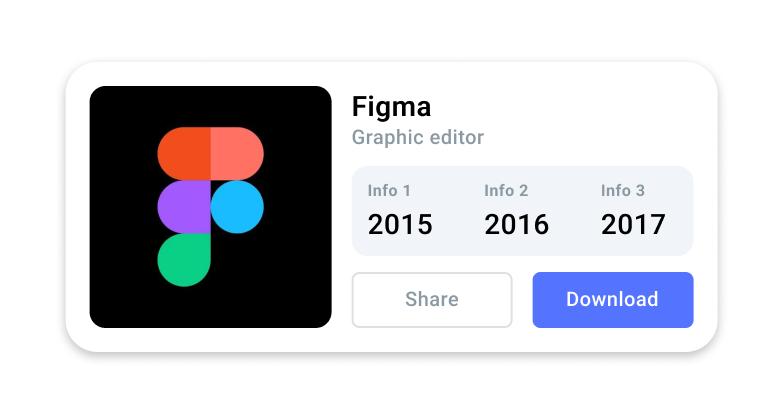
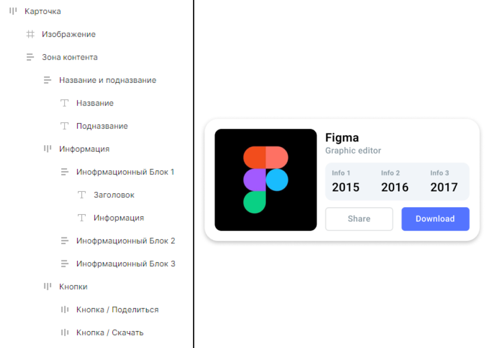
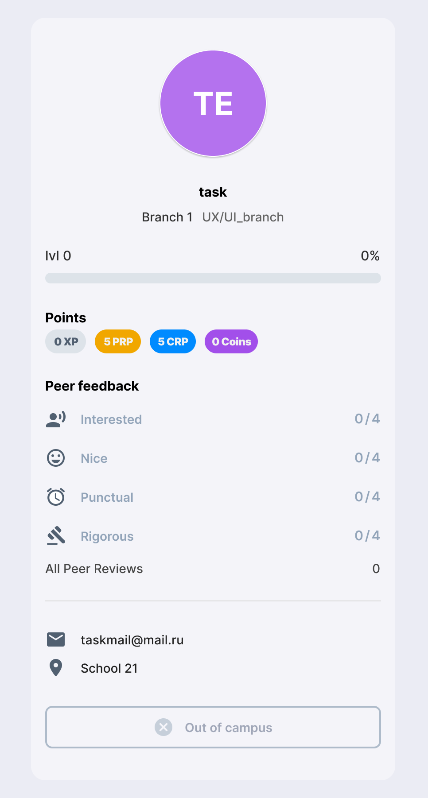

# Инструментарий UX/UI-дизайнера

В этом проекте ты познакомишься с основными инструментами, которые применяет UX/UI-дизайнер

До появления инструментов для проектирования интерфейсов использовали различные графические редакторы, такие как Photoshop. В подобных программах не было возможностей для командной работы, макеты, которые экспортировали из таких программ, было неудобно реализовывать разработчикам.
В настоящий момент, для работы UX/UI-дизайнера разработано множество инструментов, которые ускоряют и упрощают работу над разными этапами проектирования интерфейса.

Помимо проектирования интерфейсов, UX/UI-дизайнеру может понадобиться сделать такого рода задачи, как:

* отрисовать иконку или icon-pack;
* сделать логотип;
* отрисовать иллюстрацию;
* обработать изображение;
* сделать 3D-мокап.

Поэтому, помимо владения программой для проектирования интерфейсов, дизайнеру полезно изучать инструменты для создания растровой, векторной и 3D графики, такие как:

* Photoshop;
* Illustrator;
* Программы для 3D-моделирования;
* After Effects;
* Principle.

<h3 id="вспомогательный-инструментарий">Вспомогательный инструментарий</h3>

Для поиска возможных решений тех или иных кейсов, развития насмотренности существует множество сайтов, на которых выложены работы других дизайнеров.
Например, такие сайты, как:

* awwwards - сайт-конкурс, на котором выкладывают свои работы профессиональные веб-дизайнеры. На этом сайте представлены лучшие работы за год с инновационными решениями всевозможных кейсов;
* behance -  платформа, на который дизайнеры различных направлений публикуют свои работы. На ней можно найти много интересных концепций;
* pinterest - медиа-платформа, где пользователи размещают различный контент. При правильном запросе, можно найти много хороших решений и идей.

<h3 id="task-1">Task 1</h3>

* найди карточку с изображением, описанием и кнопками; Пример 
* сделай скриншот этой карточки или скачай изображение;
* назови изображение task_1;
* загрузи скриншот в формате .png в репозиторий.

Также, важно смотреть сайты-аналоги того продукта, над которым ты работаешь. Если это интернет-магазин, то необходимо посмотреть уже существующие крупные интернет-магазины, чтобы увидеть различные варианты реализации интересующего тебя функционала.

<h3 id="основной-инструментарий">Основной инструментарий</h3>

Проектирование интерфейсов происходит в специальных приложениях.
Самыми широкоиспользуемыми являются Figma, Sketch и Adobe XD. Для этих приложений доступны как браузерные версии, так и десктопные.
На нашем курсе мы будем использовать Figma.

<h3 id="task-2">Task 2</h3>

* создай аккаунт в Figma;
* создай design файл и назови его Project_2;
* перенеси в созданный файл скриншот карточки из Task 1;
* повтори карточку, которую ты нашлел, в Figma, используя простые фигуры, текстовые поля и т.д.;
* проименуй все части карточки соответствующими им именами в списке элементов;Например: изображение, кнопка, текст кнопки, заголовок описания, текст описания, название предмета.
* экспортируй файл в формате .fig и загрузи его в папку репозитория.

<h3 id="bonus-task">Bonus task</h3>

* создайт в design файле, в котором выполняли Task 2, новую страницу;
* назови новую странцу Bonus task;
* перенеси изображение карточки в файл figma:
* повтори карточку, представленную на изображении;
* проименуй все части карточки соответствующими им именами в списке элементов;
* переименуй design файл в Project_2_bonus;
* экспортируй файл в формате .fig и замени им файл Project_2.fig в репозитории.
